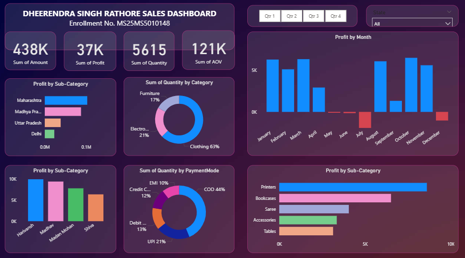

# 🛒 E-Commerce Sales & Profit Analysis Dashboard

  

<h2 align="center">📊 Power BI | E-Commerce Analytics | Sales & Profit Analysis</h2>

  An interactive Power BI dashboard designed to analyze e-commerce sales,
  profitability, product categories, payment methods, quantities, and
  monthly performance.

---

## 🎯 Project Overview

The **E-Commerce Sales & Profit Analysis Dashboard** transforms sales
transaction data into interactive business insights using Microsoft Power BI.

The dashboard helps analyze:

* 💰 Sales and profit performance
* 📦 Product quantity and category distribution
* 📈 Monthly profit trends
* 🗺️ State-wise performance
* 💳 Payment method distribution
* 🛍️ Product sub-category performance
* 📊 Average Order Value (AOV)
* 📅 Quarterly performance

---

## 📌 Key Performance Indicators

| KPI                    |     Value |
| ---------------------- | --------: |
| 💰 Total Sales         |  **438K** |
| 📈 Total Profit        |   **37K** |
| 📦 Total Quantity      | **5,615** |
| 🛒 Average Order Value |  **121K** |

---

## 🔍 Dashboard Analysis

### 📈 Monthly Profit Analysis

Tracks monthly profit performance and highlights months with positive
and negative profitability.

### 🛍️ Category Analysis

Shows quantity distribution across major product categories:

* Clothing
* Electronics
* Furniture

### 💳 Payment Mode Analysis

Analyzes transaction quantity by payment method, including:

* Cash on Delivery
* UPI
* Debit Card
* Credit Card
* EMI

### 🗺️ State-wise Profit Analysis

Compares profit performance across different states and helps identify
strong-performing markets.

### 📦 Sub-Category Analysis

Provides insights into product-level profitability and identifies
high-performing sub-categories such as:

* Printers
* Bookcases
* Saree
* Accessories
* Tables

### 📅 Quarterly Analysis

Interactive quarter filters allow users to analyze business performance
across Q1, Q2, Q3, and Q4.

---

## 💡 Key Insights

🔹 The dashboard records approximately **438K in total sales** and **37K
in total profit**.

🔹 **Clothing** contributes the largest share of quantity among the
displayed product categories.

🔹 **Cash on Delivery (COD)** represents the largest payment-mode share
of quantity.

🔹 **Printers** are among the strongest-performing sub-categories by
profit.

🔹 Monthly profit shows significant variation, with some months recording
negative profitability.

🔹 State-wise analysis highlights differences in profitability across
markets.

---

## 🛠️ Tools & Technologies

| Tool                  | Purpose                        |
| --------------------- | ------------------------------ |
| 📊 Power BI           | Dashboard & Data Visualization |
| 🔄 Power Query        | Data Cleaning & Transformation |
| 🧮 DAX                | Measures & Calculations        |
| 📁 Microsoft Excel    | Data Preparation               |
| 📈 Data Visualization | Business Insights              |

---

## 📊 Dashboard Features

✅ Interactive quarter filter
✅ State-wise filtering
✅ KPI cards
✅ Monthly profit trend
✅ Category-wise quantity analysis
✅ Payment-mode analysis
✅ State-wise profit comparison
✅ Product sub-category analysis
✅ Interactive Power BI visuals

---

## 📂 Project Files

📄 `Ecommerce_Sales_Dashboard.pbix`
→ Power BI dashboard file

🖼️ `Ecommerce_Dashboard.png.png`
→ Dashboard preview image

📘 `README.md`
→ Project documentation

---

## 🎓 Learning Outcomes

Through this project, I developed practical experience in:

* Data cleaning and transformation
* Power Query
* DAX calculations
* KPI development
* Sales analytics
* Profitability analysis
* E-commerce analytics
* Interactive dashboard design
* Business data storytelling

---

## 👨‍💻 Author

### **Dheerendra Singh Rathore**

🎓 MBA | Finance & Marketing
📊 Aspiring Financial / Data Analyst
💡 Interested in Finance, Business Analytics & Data Visualization

---

## ⭐ Support

If you find this project useful, consider giving the repository a ⭐.

  <b>Built with Power BI 📊</b>

